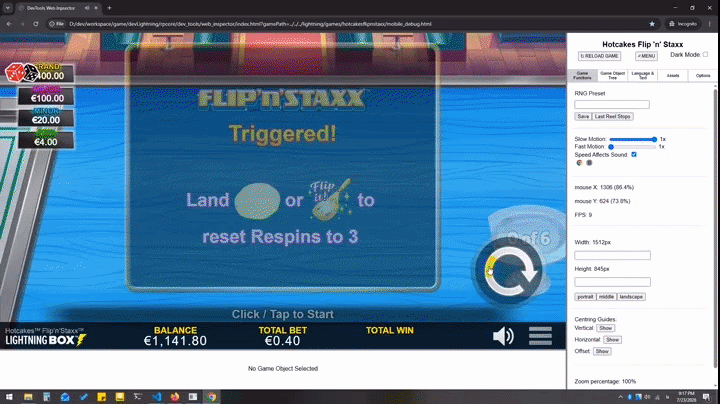

# Hi there, I'm Aref Koohzadi 👋 
### Senior Front-End & Slot Game Developer | PixiJS & TypeScript Specialist

---

## 🎰 About Me

I am a **Front-End and Slot Game Developer** with **6+ years of experience** specializing in high-performance, real-money web-based slot games for international online casino platforms.

During my 6-year tenure at [**Boomerang Studios**](https://boomerang-studios.com/), I architected, developed, and delivered **30+ full-cycle slot games**. Through outsourced game development partnerships, I worked directly with tier-1 industry leaders including [**Light & Wonder (L&W)**](https://lnw.com/) and [**Lightning Box Games**](https://www.lightningboxgames.com/), building titles that fully comply with their strict engine, regulatory, and production standards.

- 🎮 **Core Expertise:** WebGL/Canvas Rendering, Particle Systems & Custom Visual VFX, Custom Keyframe Controllers, Sprite Sheet & Spine Animations, Hybrid Animation Pipelines, Reel Mechanics & Game State Management.
- 🧮 **Mathematical Foundation:** M.Sc. in Numerical Analysis — leveraging numerical algorithms to optimize rendering performance, sequential time offsets, particle pooling, and state transitions.
- 🛠️ **Tech Focus:** TypeScript, JavaScript, PixiJS, Particle Systems, Spine 2D, Keyframe Animation Systems, GSAP, Vue.js, WebGL, FFmpeg.

---

## 🛠️ Tech Stack & Advanced Capabilities

| Domain | Technologies & Workflows |
|---|---|
| **Game Engines & Graphics** | PixiJS, WebGL, Canvas API, Spine 2D, GSAP |
| **VFX & Animation Systems** | Particle Systems (Custom & Emitters), Custom Keyframe Controllers, Sprite Sheet Animations, Hybrid Pipelines |
| **Languages & Frameworks** | TypeScript, JavaScript (ES6+), Vue.js, HTML5, CSS3/SASS |
| **Asset & Media Optimization** | WebP Texture Packing, FFmpeg Audio Sprite Generation, Lossless Compression |
| **Architecture & Math** | GDM Response State Translation, Reel & Grid Mechanics, Numerical Analysis, MATLAB |
| **Tools & Workflows** | Git, GitHub, VS Code, Jira, Agile/Scrum, Debugging Tools |

---

## 🌟 Featured Slot Games Showcase

Below are flagship slot projects developed for international markets, highlighting core feature architectures (Original Mechanics), live playable demos, and advanced engine components.

---

### 1. 🐲 Thundering Shenlong (Original Feature Framework)
> **Role:** Lead Front-End Developer | **Stack:** TypeScript, PixiJS, Particle VFX, Custom Keyframe Controller, GSAP

👉 **[🎮 Play Live Demo on Light & Wonder (L&W)](https://igaming.lnw.com/games/thundering-shenlong-2/)**

**Technical Highlights & Architecture:**
- **Architected the Benchmark "Thundering" Mechanic:** Designed and developed the original core feature architecture, state machine, and visual particle sequences for *Thundering Shenlong*. This framework became the foundational engine for several spin-off titles across the studio, including *Thundering Gorilla* and *Thundering Box Keno*.
- **Cross-Genre Game Development (Keno Adaptation):** Adapted the core mechanics into the Keno domain to build *Thundering Box Keno*, successfully extending the framework beyond traditional slot engines.
- **Visual FX & Audio Sync:** Engineered high-impact particle emitters, screen-shake sequences, and multi-stage audio feedback for Big Wins and bonus rounds.

---

### 2. 👑 Chongfu Jiangpin Emperor's Crown
> **Role:** Lead Front-End Game Developer | **Stack:** TypeScript, PixiJS, Particle Systems, Spine 2D, Keyframe Controller, GSAP

**Technical Highlights & Core Features:**
- **Color-Coded 3-Pot Accumulator Architecture:** Developed a multi-pot top housing array (Red for Jackpot Feature; Blue & Green for Chongfu Feature) supporting simultaneous, multi-feature triggers based on state machine evaluations.
- **Dynamic Coin Trajectory & Particle Projection:** Engineered custom bezier trajectory math to launch coin particles from landing reel symbols directly into their corresponding color-matched pots.
- **Dynamic Pot Scaling & Particle Explosions:** Implemented real-time pot expansion animations upon feature trigger, followed by heavy full-screen coin particle explosions and smooth transitions into the feature intro screens.
- **Hybrid Animation & Sequential Timing:** Combined Sprite Sheet animations, Spine character rigs, and Custom Keyframe Controllers with precise sequential time offsets for high-payline win evaluations at a locked 60 FPS.

---

### 3. 🐔 Chicken Fox & Egglink Series (Original Feature Creator)
> **Role:** Lead Front-End Developer | **Stack:** TypeScript, PixiJS, WebGL, Particle VFX, Custom Trajectory Physics, Vue.js

👉 **[🎮 Play Live Demo: Chicken Fox Jr](https://igaming.lnw.com/games/chicken-fox-jr-on/)**  
👉 **[🎮 Play Live Demo: Stellar Cash Chicken Fox 5x](https://igaming.lnw.com/games/stellar-cash-chicken-fox-5x-skillstar-us/)**

**Technical Highlights & Architecture:**
- **Pioneered & Built the Original "Egglink" Accumulator Mechanic:** Architected and developed the first-ever Egglink feature implementation starting with *Egglink Chicken Fox*, which established a core mechanics engine used in subsequent spin-off titles (e.g., *Egglink One Hundred XRA*, *Egglink Silver Pride*).
- **Complex Projectile & Particle Physics:** Engineered the top-roof accumulator system where egg symbols launch particles/sprites from reels into the upper housing array. Built custom trajectory & acceleration math for the feature trigger phase, animating dozens of falling eggs covering the entire view smoothly at 60 FPS.
- **Game Family Evolution:** Developed multiple high-performing titles in the franchise including *Chicken Fox Jr* and *Stellar Cash Chicken Fox 5x Skillstar*.
- **GDM Response Translation:** Developed robust backend state translators to process dynamic payload responses into sequential visual accumulator steps and multi-stage feature triggers.

---

### 4. 🥞 Hotcakes Flip NStaxx
> **Role:** Lead Front-End Game Developer | **Stack:** TypeScript, PixiJS, Spine 2D, Keyframe Controller, Sprite Sheet Animations, GSAP

| Jackpot Pick Feature | Spatula Flip & Respin Mechanic |
| :---: | :---: |
|  |  |

**Technical Highlights & Core Features:**
- **Hybrid Animation Jackpot System:** Architected the interactive Jackpot Pick Feature utilizing a synchronized combination of **Spine 2D skeletal animations**, **Custom Keyframe Controllers**, and **Sprite Sheet Animations** to deliver rich visual feedback.
- **Interactive Spatula Flip & Cooking Physics:** Developed the signature Respin mechanic where landed pancake symbols are flipped using a spatula sprite animation to convey a realistic cooking/baking transition upon landing.
- **Collector Mini-Feature Trigger:** Built accumulator state logic to track spatula symbols; collecting 6 pancake symbols dynamically triggers a specialized bonus mini-feature round.
- **Custom Reel Spin Physics & Easing:** Implemented custom deceleration algorithms and elastic bounce easing for realistic symbol stops.
- **Asset Pipeline Optimization:** Optimized texture atlases using **WebP image formats**, achieving sub-2-second initial loading times across mobile and desktop platforms.

---

### 5. 🥁 Thunder Drums Series (Leaping Lions & Samurai Storm)
> **Role:** Lead Front-End Developer | **Stack:** TypeScript, PixiJS, Spine 2D API, Multi-Pot Accumulator, Particle VFX, GSAP

👉 **[🎮 Play Live Demo: Thunder Drums Leaping Lions](https://igaming.lnw.com/games/thunder-drums-leaping-lions/)**  
👉 **[🎮 Play Live Demo: Thunder Drums Samurai Storm](https://igaming.lnw.com/games/thunder-drums-samurai-storm-2/)**

**Technical Highlights & Architecture:**
- **Pioneered the "Thunder Drums" Framework:** Architected the inaugural UI layout and core feature engine for *Thunder Drums Leaping Lions* (the first title with this unique visual layout for L&W), which became the foundation for subsequent series entries such as *Thunder Drums Samurai Storm* and *Thunder Drums Serengeti Sun*.
- **Color-Coded Multi-Pot Accumulator Mechanics:** Built a 3-drum top housing array with dynamic particle projection math—routing color-matched thunder symbols from base reels directly into their corresponding drums.
- **Dynamic Drum Scaling & Multi-Feature Triggers:** Developed responsive scaling algorithms and drum-beating animations that dynamically trigger independent or combined bonus features based on state machine evaluations.
- **Seamless Spine Scene Transitions:** Engineered smooth, state-driven visual transitions switching from the base game reel set to feature intro scenes using rich Spine 2D skeletal animations.
